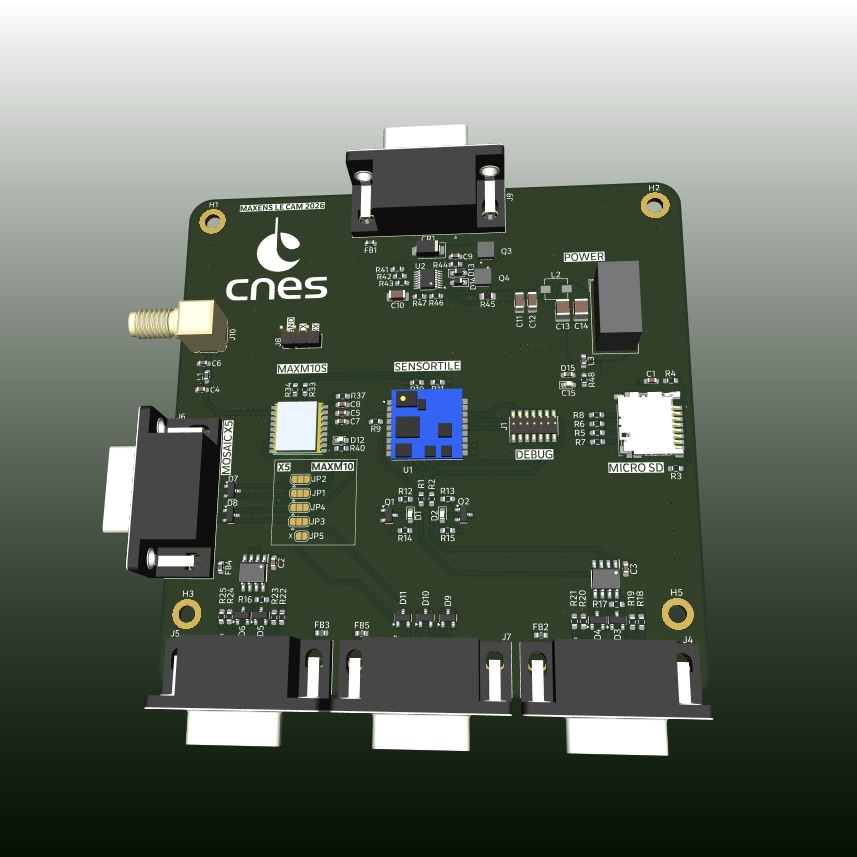
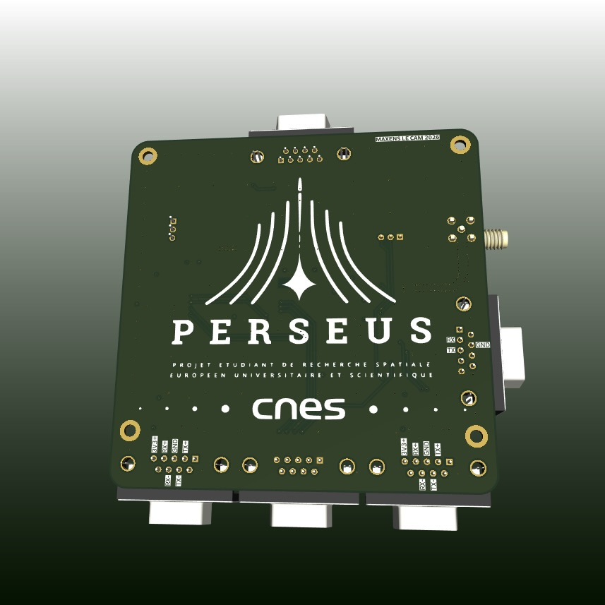

# PERSEUS DAQ Board
<div style="display:flex; width:100%;"></div>

Carte electronique d'acquisition de donnees pour le programme fusees etudiantes PERSEUS du CNES.

Le role de cette carte est de s'interfacer avec l'OBC de la fusee, de mesurer l'environnement embarque, de stocker les donnees localement sur carte SD et de renvoyer les donnees utiles sur les bus serie de bord pour la prise de decision.

## Architecture

La carte est autonome cote alimentation et protection :

- entree depuis le bus courant de l'OBC
- protections surtension, sous-tension et surintensite
- regulation locale 3.3 V pour l'electronique embarquee
- conversion UART vers RS422 ou RS485 selon les interfaces

Coeur fonctionnel :

- SensorTile SMD au centre de la carte
- capteurs MEMS via le firmware ST `FP-SNS-ALLMEMS1`
- fusion inertielle MotionFX
- logging SD conserve
- BLE conserve pour debug/validation avec ST BLE Sensor
- sortie UART SensorTile vers transceiver RS422/RS485 pour l'OBC

GNSS :

- u-blox MAX-M10S integre sur la carte
- connecteur SMA pour l'antenne du MAX-M10S
- interface pour GNSS externe Septentrio mosaic-X5
- SUB-D 9 pour commandes UART du mosaic-X5
- canal serie dedie pour que l'OBC dialogue avec le MAX-M10S ou le mosaic-X5 via conversion RS422/UART

## Organisation du depot

```text
hardware/kicad/
  Projet KiCad de la carte PERSEUS DAQ Board.

firmware/sensortile-allmems1-uart-fusion/
  Overlay firmware pour FP-SNS-ALLMEMS1 sur SensorTile.
  Ajoute une sortie UART de trames fusion/quaternion, destinee a un convertisseur UART -> RS422.

docs/
  Synoptique systeme et documents projet.

references/obc/
  Fichiers et documents de reference lies a l'OBC PERSEUS.
```

## Firmware SensorTile

Le firmware modifie part du projet ST :

```text
fp-sns-allmems1/Projects/STM32L476JG-SensorTile/Applications/ALLMEMS1
```

Objectif firmware :

- BLE actif
- logging SD actif
- capteurs ALLMEMS1 conserves
- MotionFX actif
- USB CDC debug desactive si conflit de pins avec l'UART
- sortie UART ajoutee pour diffuser les quaternions

Important : la SensorTile ne sort pas directement du RS422. Elle sort un UART logique. La conversion vers RS422/RS485 est faite par les transceivers de la carte.

Voir [firmware/sensortile-allmems1-uart-fusion/README.md](firmware/sensortile-allmems1-uart-fusion/README.md).

## Synoptique


## Nom du repo

Nom recommande pour GitHub :

```text
perseus-daq-board
```

L'ancien nom `sequenceur_perseus` ne correspond plus au role actuel de la carte.
