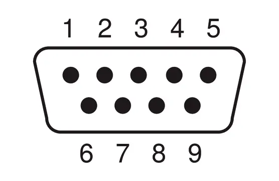

# Hardware – PERSEUS DAQ Board

KiCad design files for the PERSEUS DAQ Board.

Main project:

```text
hardware/kicad/PERSEUS_DAQ_BOARD.kicad_pro
```

Main functions:

- protected power input from the OBC current bus
- local 3.3 V regulation
- SensorTile SMD integration
- MAX‑M10S GNSS integration with SMA antenna connector
- external mosaic‑X5 GNSS interface
- SD card interface
- UART to RS422/RS485 conversion channels
- SUB‑D 9 connectors for OBC and GNSS serial links

## 📂 Contenu du répertoire `hardware`

- **OBC_EXT_PCB.pdf** – schéma du PCB principal.
- **OBC_EXT_Schéma.pdf** – schéma électrique détaillé.
- **images/** – répertoire contenant les rendus et schémas d’illustration.
- **README.md** – ce fichier.



### 📋 Tables de brochage

#### J4 – RS‑422 voie 1

| Broche | Fonction |
|--------|----------|
| 1 | GND, optionnel, via R21 0 Ω |
| 2 | TX1+ |
| 3 | GND |
| 4 | RX1+ |
| 5 | +3V3, optionnel, via R18 0 Ω |
| 6 | GND, optionnel, via R20 0 Ω |
| 7 | TX1− |
| 8 | RX1− |
| 9 | GND, optionnel, via R19 0 Ω |
| **Blindage** | Shield1, relié au GND par FB2 |

#### J5 – RS‑485 / RS‑422 voie 2

| Broche | Fonction |
|--------|----------|
| 1 | GND, optionnel, via R25 0 Ω |
| 2 | TX2+ |
| 3 | GND |
| 4 | RX2+ |
| 5 | +3V3, optionnel, via R22 0 Ω |
| 6 | GND, optionnel, via R24 0 Ω |
| 7 | TX2− |
| 8 | RX2− |
| 9 | GND, optionnel, via R23 0 Ω |
| **Blindage** | Shield2, relié au GND par FB3 |

#### J6 – GNSS Mosaic‑go X5

| Broche | Fonction |
|--------|----------|
| 1 | +3V3 |
| 2 | RX2X5 – réception UART vers la carte |
| 3 | TX2X5 – émission UART depuis la carte |
| 4 | X5_TIMEPULSE |
| 5 | GND |
| 6 | GND |
| 7 | GND |
| 8 | GND |
| 9 | X5_EXTINT |
| **Blindage** | Shield3, relié au GND par FB4 |

#### J7 – GPIO, SensorTile et GNSS

| Broche | Fonction |
|--------|----------|
| 1 | GND |
| 2 | GNSS_EXTINT |
| 3 | GND |
| 4 | SENSORTILE_SCL |
| 5 | GND |
| 6 | GNSS_NRST |
| 7 | GNSS_TIMEPULSE |
| 8 | SENSORTILE_NRST |
| 9 | SENSORTILE_SDA |
| **Blindage** | Shield4, relié au GND par FB5 |

#### J9 – Alimentation batterie 24 V

| Broche | Fonction |
|--------|----------|
| 1 | Bat_24V+ |
| 2 | Bat_24V+ |
| 3 | Non connecté |
| 4 | Bat_24V− |
| 5 | Bat_24V− |
| 6 | Bat_24V+ |
| 7 | Non connecté |
| 8 | Non connecté |
| 9 | Bat_24V− |
| **Blindage** | Relié au GND par FB1 |

### 📐 Mapping des signaux différentiels (J4 & J5)

| Signal | Broche |
|--------|--------|
| RX+ | 4 |
| RX− | 8 |
| TX+ | 2 |
| TX− | 7 |
| GND principal | 3 |

Les autres broches sont des options d’alimentation ou de masse configurables par résistances 0 Ω.
